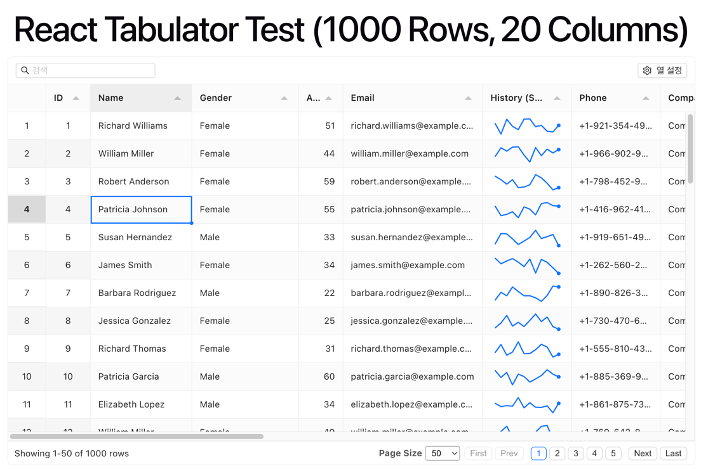

# ReactTabulator

[Tabulator](https://tabulator.info) 를 감싼 React 래퍼 컴포넌트. Ant Design 톤 테마, quick filter(Fuse.js),
열 설정(표시/숨김 + localStorage 저장/복원), range 선택/클립보드, 편집 셀 강조 등을 옵션으로 제공합니다.

이 폴더는 **자족적(self-contained)** 이며 다른 React 프로젝트로 폴더째 복사하여 사용할 수 있습니다.
(프로젝트 경로 alias 없이 상대경로/npm 패키지 import 만 사용)

## Peer dependencies

대상 프로젝트에 아래 패키지가 설치되어 있어야 합니다.

```bash
pnpm add react react-dom ahooks fuse.js tabulator-tables react-tiny-popover
```

| 패키지 | 용도 |
| --- | --- |
| `react`, `react-dom` | React 18/19 (createRoot, useInsertionEffect 사용) |
| `ahooks` | quick filter debounce(useDebounceFn) |
| `fuse.js` | quick filter fuzzy 검색 |
| `tabulator-tables` | 테이블 코어 + 기본 CSS |
| `react-tiny-popover` | 열 설정 Popover (zero-dep) |

> **antd / @ant-design/icons 의존 없음.** UI(Button/Checkbox/Switch/Divider/Input)는 로컬 primitives, 아이콘은 인라인 SVG,
> 색/여백 토큰은 로컬 기본 토큰(`./tokens`, Ant Design 라이트 톤)으로 자체 제공됩니다.

### 다크모드/커스텀 테마 동기화 (선택)
antd 를 쓰는 앱이라면 antd 토큰을 주입해 테마를 동기화할 수 있습니다(컴포넌트 자체는 여전히 antd 무의존):

```tsx
import { theme } from "antd";
const { token } = theme.useToken();
const { antdTabulator } = useAntdTabulatorTheme(token); // 기본값 대신 antd 토큰 주입
```

## 사용법

```tsx
import { ReactTabulator, reactFormatter, useAntdTabulatorTheme } from "@/components/react-tabulator";

function Example({ rows }: { rows: any[] }) {
  const { antdTabulator } = useAntdTabulatorTheme(); // antd 톤 테마 클래스

  const columns = [
    { title: "코드", field: "code", width: 150 },
    { title: "이름", field: "name" },
    { title: "상태", field: "status", editor: "input" }, // 더블클릭/Enter 로 편집
    { title: "숨김열", field: "memo", visible: false },
  ];

  return (
    <ReactTabulator
      className={antdTabulator}
      data={rows}
      columns={columns}
      persistKey="example:columns"                 // 열 가시성/폭/순서 저장 키
      headerToolbar={{ quickFilter: true, columnSetting: true }}
      options={{ layout: "fitDataStretch", height: "400px" }}
    />
  );
}
```

## 주요 Props

| Prop | 타입 | 설명 |
| --- | --- | --- |
| `data` | `any[]` | 행 데이터 (변경 시 `replaceData` 로 증분 갱신) |
| `columns` | `ColumnDefinition[]` | Tabulator 컬럼 정의 (그룹 컬럼 지원) |
| `options` | `object` | Tabulator 옵션 (기본 옵션에 병합) |
| `events` | `Record<string, fn>` | Tabulator 이벤트 핸들러 |
| `className` / `style` | | 컨테이너에 적용 |
| `onRef` | `(ref) => void` | Tabulator 인스턴스 ref 전달 |
| `persistKey` | `string` | 열 가시성/폭/순서를 localStorage 에 저장/복원 |
| `rowNumber` | `boolean` | 행번호(전체 순번) 컬럼 표시 여부. 기본 `true`, `false` 면 숨김 |
| `headerToolbar` | `HeaderToolbarConfig` | 상단 header 툴바(미지정 시 미표시) |
| `flashOnChange` | `boolean` | 데이터 갱신 시 값이 바뀐 셀을 플래시로 강조. 기본 `false`. 아래 [실시간 갱신/애니메이션](#실시간-갱신애니메이션) 참고 |
| `flashDuration` | `number` | flash 지속 시간(ms). 기본 `800` |
| `coalesceUpdates` | `boolean` | data 갱신을 rAF 로 coalescing(프레임당 1회 렌더). 기본 `false` |
| `animateRows` | `boolean` | 재정렬로 행 위치가 바뀔 때 부드럽게 슬라이드(FLIP). 기본 `true` |
| `animateRowsDuration` | `number` | 행 이동 애니메이션 지속 시간(ms). 기본 `250` |
| `animateCols` | `boolean` | 열 표시/숨김 시 나머지 열을 부드럽게 슬라이드(FLIP). 기본 `true` |
| `animateColsDuration` | `number` | 열 이동 애니메이션 지속 시간(ms). 기본 `250` |
| `autoSelectFirstCell` | `boolean` | 최초 렌더링 시 첫 번째 셀 자동 선택 여부. 기본 `false` (사용자가 표를 클릭하기 전까진 선택 상태 미표시) |

### `HeaderToolbarConfig`

| 필드 | 타입 | 설명 |
| --- | --- | --- |
| `quickFilter` | `boolean \| QuickFilterConfig` | header 왼쪽 검색 입력 (기본 표시). `QuickFilterConfig`: `keys`, `placeholder`, `debounce`, `exact` |
| `columnSetting` | `boolean` | header 오른쪽 내장 열 설정 UI(표시/숨김 + 저장 스위치). 저장 스위치는 `persistKey` 지정 시 표시 |
| `rowActions` | `boolean` | 상단 툴바 플러스(추가) / 마이너스(삭제) 버튼 표시 여부. 기본 `false` |

## 기본 동작 (DEFAULT_OPTIONS)

- 정렬: 아이콘 클릭, 3단계 토글(오름→내림→해제)
- range 선택 + 클립보드 복사/붙여넣기(스프레드시트 방식)
- 컬럼 전체 선택: `Alt + 왼쪽 클릭` (Windows) / `Option + 왼쪽 클릭` (Mac)
- `editor` 셀은 더블클릭 또는 Enter 로만 편집, 값 변경 시 셀 강조
- 행번호(rowHeader) 전체 순번 표시

## 행 추가 / 삭제 관리 (`rowActions`)

`headerToolbar: { rowActions: true }` 설정 시 추가/삭제 토글 기능을 제공합니다.
- **`+` (추가)**: 현재 보고 있는 페이지 상단에 신규 행 생성 (배경색: 옅은 파란색). 내부적으로 `_isNew` 플래그 관리.
- **`-` (삭제)**: 선택된 범위(또는 선택된 행)의 삭제 상태를 토글. 기존 데이터는 취소선이 표시(내부적 `_isDeleted` 플래그 관리)되며, 플러스 버튼으로 방금 추가된 행인 경우 실제 데이터 및 화면에서 완전히 물리적 삭제됩니다.

추가/삭제된 데이터 목록(Diff)은 아래 전용 API를 호출하여 백엔드 전송용으로 쉽게 추출할 수 있습니다:
```tsx
const addedData = tableRef.current.getNewRowsData();
const deletedData = tableRef.current.getDeletedRowsData();
```



## 실시간 갱신/애니메이션

빈번한 데이터 갱신·정렬·열 토글을 부드럽게 보여주기 위한 옵션들입니다. Tabulator 에 네이티브 옵션이 없어 **FLIP 기법**으로 직접 구현했습니다.

### `animateRows` (기본 `true`)

재정렬로 행 위치가 바뀔 때 옛 위치 → 새 위치로 슬라이드시킵니다(AG Grid `animateRows` 유사).

```tsx
<ReactTabulator data={rows} columns={cols} animateRows animateRowsDuration={250} />
```

- **동작**: `updateData`/정렬 후 위치가 바뀐 행이 새 위치로 부드럽게 이동
- **쿨다운**: 고빈도 갱신에서 애니메이션이 겹치지 않도록, 직전 슬라이드가 끝난 뒤(≥ `animateRowsDuration`)에만 새 슬라이드를 시작 → reflow 폭주 방지 + 항상 끝까지 재생
- **한계(가상 스크롤)**: 갱신 전·후 **모두 뷰포트에 보이는 행만** 연출됩니다(뷰포트/페이지 밖으로 이동하는 행은 즉시 반영). AG Grid 도 동일한 한계.

### `animateCols` (기본 `true`)

열 설정 메뉴에서 열을 표시/숨길 때, 좌우로 밀리는 열들을 슬라이드시킵니다.

```tsx
<ReactTabulator data={rows} columns={cols} headerToolbar={{ columnSetting: true }} animateCols />
```

- **동작**: 열을 숨기면 오른쪽 열들이 왼쪽으로, 표시하면 오른쪽으로 슬라이드하며 자리 이동
- **대상 열 자체**는 즉시 나타남/사라짐 — 나머지 열이 자리를 내주며 이동
- **frozen 열**(예: ID/코드)은 위치가 고정이라 애니메이션에서 제외

### `flashOnChange` (기본 `false`) / `coalesceUpdates` (기본 `false`)

- `flashOnChange`: 값이 바뀐 셀을 잠깐 강조(숫자 증가=초록, 감소·비숫자=빨강 → 투명 페이드). `flashDuration`(기본 800ms)로 지속 시간 조정. 행 매칭은 `options.index`(기본 `"id"`) 기준이라 **안정적 id** 가 필요합니다.
- `coalesceUpdates`: `data` prop 이 한 프레임에 여러 번 바뀌어도 `requestAnimationFrame` 으로 합쳐 **프레임당 최대 1회만** 갱신/재렌더. 수~수십 Hz 고빈도 실시간 갱신에서 재렌더 오버헤드를 크게 줄입니다(저빈도에선 효과 미미).

> 정렬이 활성인 상태에서 `updateData` 로 값이 바뀌면, 정렬 기준 필드가 바뀐 경우 자동으로 재정렬되어 순서/행번호(순번)가 현재 표시 순서에 맞게 갱신됩니다.

## 헬퍼

- `reactFormatter(<Cell />)`: Tabulator 셀에 React 컴포넌트를 렌더링하는 formatter. 전달 컴포넌트는 `cell`/`value`/`rowData` props 를 받습니다.
- `useAntdTabulatorTheme()`: antd 톤 테마 클래스명을 반환(`{ antdTabulator }`). `className` 으로 전달해 사용.
- `createSparkChartFormatter(options)`: canvas 기반 경량 스파크 차트(bar/line) formatter 를 생성. 아래 [스파크 차트](#스파크-차트-createsparkchartformatter) 참고.
- `createSparkBarFormatter(options)`: `createSparkChartFormatter({ type: "bar" })` 하위호환 편의 함수.

## 스파크 차트 (createSparkChartFormatter)

React/차트 라이브러리 무의존. 셀당 canvas 하나만 생성해 즉시 draw 하므로 대량 행에서도 비용이 낮습니다.
반환값을 컬럼의 `formatter` 로 넘기면 됩니다. `type: "bar"`(기본) 또는 `type: "line"`(sparkline)을 지원합니다.

```tsx
import { createSparkChartFormatter } from "@/components/react-tabulator";

const columns = [
  // 막대 (기본)
  { title: "추이", field: "trend", formatter: createSparkChartFormatter() },
  // 영역 채운 라인 + 점 강조
  { title: "매출", field: "sales", formatter: createSparkChartFormatter({ type: "line", fill: true, showDots: true }) },
];
```

### 공통 옵션

| 옵션 | 타입 | 기본값 | 설명 |
| --- | --- | --- | --- |
| `type` | `"bar" \| "line"` | `"bar"` | 차트 종류 |
| `accessor` | `(cell) => number[]` | `cell => cell.getValue() ?? []` | 셀에서 값 배열 추출 (필드가 이미 `number[]` 면 생략) |
| `width` / `height` | `number` (px) | `90` / `22` | canvas 크기 (컬럼 폭·행 높이에 맞춤) |
| `color` | `string \| (v,i,arr)=>string` | `"#1677ff"` | bar=채움색 / line=선·점색 (함수면 값별) |
| `domain` | `"auto" \| [min,max]` | `"auto"` | 정규화 기준. `"auto"`=셀별 min~max, 고정=행 간 비교 가능(범위 밖 값 클램프) |
| `padding` | `number` (px) | `1` | 가장자리 여백 (마크가 잘리지 않게) |
| `trackColor` | `string` | 없음 | 배경 트랙. bar=슬롯 뒤 / line=canvas 전체 배경 |

### `type: "bar"` 전용

| 옵션 | 타입 | 기본값 | 설명 |
| --- | --- | --- | --- |
| `gap` | `number` (px) | `1` | 막대 간격 |
| `minBarHeight` | `number` (px) | `1` | 최솟값 막대 최소 높이 (0=최솟값 막대 숨김) |

### `type: "line"` 전용

| 옵션 | 타입 | 기본값 | 설명 |
| --- | --- | --- | --- |
| `lineWidth` | `number` (px) | `1.5` | 선 두께 |
| `fill` | `boolean \| string` | `false` | 선 아래 영역. `true`=선색 alpha 0.15 / 문자열=지정색 |
| `showDots` | `boolean` | `false` | 각 데이터 점에 dot 표시 |
| `dotRadius` | `number` (px) | `1.5` | dot 반지름 (`showDots` 시) |

### 예시

```tsx
// 라인 sparkline
createSparkChartFormatter({ type: "line" })

// 감소=빨강 / 증가·유지=초록 (line 은 세그먼트별 색)
createSparkChartFormatter({
  type: "line",
  color: (v, i, arr) => (i > 0 && v < arr[i - 1] ? "#ff4d4f" : "#52c41a"),
})

// 행 간 높이 비교용 고정 스케일
createSparkChartFormatter({ type: "bar", domain: [0, 100] })

// 값이 객체 안에 있을 때
createSparkChartFormatter({ accessor: cell => cell.getValue()?.points ?? [] })
```

> **참고**
> - `color` 가 **함수**면 line 은 세그먼트별 색(시작 점 값 기준), 문자열이면 단색 연속선입니다.
> - `fill: true` 는 `color` 가 함수여도 대표색(문자열이 아니면 기본 `#1677ff`)으로 채웁니다. 채움색을 명확히 하려면 `fill: "rgba(...)"` 처럼 문자열로 지정하세요.
> - `domain: "auto"` 는 셀마다 스케일이 달라 행 간 높이 비교가 무의미합니다. 비교가 목적이면 `[min, max]` 로 고정하세요.

## 구현 범위 — 네이티브 wrapping vs 직접 구현

이 래퍼가 Tabulator 고유 기능을 그대로 전달(wrapping)한 부분과, Tabulator에 없거나 커스텀 로직으로 직접 구현한 부분을 구분한다.

### Tabulator 네이티브를 그대로 wrapping (옵션 전달)

- 페이지네이션(`pagination`/`paginationSize`), 레이아웃(`layout`), 컬럼 이동(`movableColumns`)
- range 선택/클립보드(`selectableRange`, `clipboard*`), 셀 편집(`editor`/`editTriggerEvent`)
- 내장 formatter: `money`, `star`, `progress`, `tickCross`
- 그룹 컬럼(`columns` 중첩), 정렬(`sorter`/`headerSortTristate`), 행번호(`rowHeader`)
- persistence 엔진 자체(`persistence`/`persistenceID` — 저장/복원 동작)
- 데이터/컬럼 갱신 API(`replaceData`/`setColumns`)


### 직접 구현 (커스텀)

| 항목 | 내용 | 커스텀 이유 |
| --- | --- | --- |
| React 생명주기 브리지 | 최초 1회 build → `replaceData`/`setColumns` 증분 갱신, StrictMode 안전 정리 | 바닐라 Tabulator의 React 통합 |
| `reactFormatter` | 셀에 React 컴포넌트를 `createRoot`로 렌더 | Tabulator formatter는 HTML/DOM만 지원 |
| quick filter | 전체 행을 Fuse.js로 fuzzy/부분일치 검색 → `setFilter` 적용, 입력 UI + debounce(ahooks) | 전 컬럼 결합·퍼지 검색은 내장에 없음 |
| 열 설정(columnSetting) 내장 UI | 컬럼 표시/숨김 체크박스 + 그룹 parent/child 재귀 렌더 + 저장 스위치 Popover | Tabulator는 이 UI 미제공(persistence는 UI 없음) |
| 행 추가/삭제(rowActions) UI | 툴바 버튼을 통해 신규행 추가(옅은 파란색) 및 기존행 삭제 토글(취소선). API 추출 기능 제공 | 복잡한 UI 상태 동기화 및 렌더링 최적화 |
| headerToolbar 레이아웃 | 상단 header(좌: quick filter, 우: 열 설정/행관리)를 하나의 박스로 | Tabulator 기능 아님 |
| 헤더 클릭/더블클릭 분리 | 클릭=정렬 순회, Alt+클릭=컬럼 전체 선택(`addRange`) | 네이티브는 클릭에 정렬·선택이 섞임 |
| 정렬 아이콘(↑/↓/↕ SVG) | `headerSortElement`에 커스텀 SVG + 높이/색 CSS | 기본 삼각형 대체 |
| persist on/off 게이팅 | 커스텀 `persistenceReaderFunc`/`WriterFunc` + 저장 플래그, off 시 타입별 키 일괄 제거 | 네이티브 persistence는 항상 on |
| 수정 셀 강조 | `cellEdited`에서 초기값 비교 → 클래스 부여 + 연한 붉은색 CSS | Tabulator에 변경 셀 표시 없음 |
| antd 톤 테마 | `useAntdTabulatorTheme` — 토큰 기반 CSS를 `useInsertionEffect`로 주입(스코프 클래스) | 기본 테마 대신 커스텀 |
| 로컬 UI primitives | Button/Checkbox/Switch/Divider/Input(직접), Popover(react-tiny-popover) | antd 의존 제거용 자체 구현 |
| antd 무의존 토큰 시스템 | `tokens.ts` 기본 토큰 + 주입 옵션 | 자체 디자인 값 |
| CSS 세부 | frozen 셀 불투명 배경, zebra 스트라이프, rowHeader 스타일, header+table 단일 박스, flex 채움, 정렬/링크/range 하이라이트 색 | 전부 커스텀 CSS |
| 행번호 전체 순번 | `getPosition + (page-1)*pageSize` | 네이티브 `rownum`은 페이지 내 1부터 |

> 요약: 엔진/동작(정렬·필터·편집·페이지·persistence·range·formatter)은 대부분 네이티브를 wrapping했고,
> React 통합·UI(툴바/열설정/primitives/팝오버)·Fuse 검색·상호작용 분리(클릭/더블클릭·수동 정렬)·테마/토큰·셀 강조·정렬 아이콘·행번호는 직접 구현했다.
